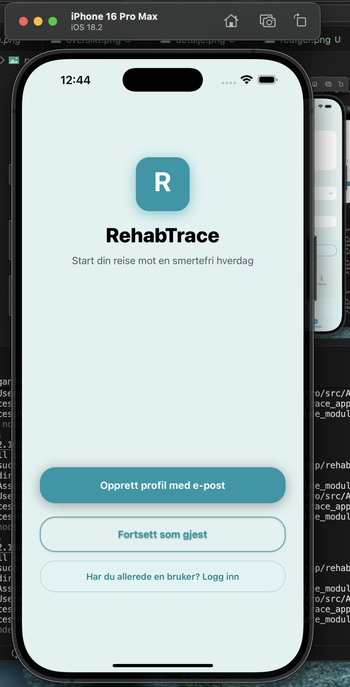
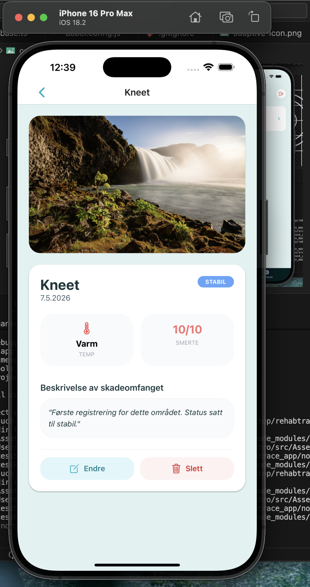

# rehab-trace

A cross-platform application designed for athletes to document and track minor sports injuries through structured observations, including pain levels, mobility, and photo documentation.

## Screenshots

| Welcome Screen | Authentication | Dashboard (Dark) |
| :---: | :---: | :---: |
|  |  |  |

| New Entry | Status Calculation | History Detail |
| :---: | :---: | :---: |
|  |  |  |

## Tech Stack

- **Framework:** React Native with Expo (SDK 54)
- **Language:** TypeScript
- **Navigation:** Expo Router (File-based routing)
- **Styling:** NativeWind (Tailwind CSS)
- **Backend:** Firebase (Database & Integration)
- **State Management:** React Context API & Custom Hooks
- **Animations:** React Native Reanimated

## Getting Started

1. **Clone the repository**
2. **Install dependencies:** `npm install`
3. **Start the development server:** `npx expo start`

## Development & Testing

This project was developed and tested using:
- **Environment:** Expo Go
- **Simulators:** iOS Simulator (Xcode) running **iPhone 16 Pro**
- **Physical Devices:** Tested on iOS devices via Expo Go to ensure touch responsiveness and native feel.

## Roadmaps & Upcoming Features 🚀

I am actively working on enhancing the user experience and adding more robust features:
- **Custom Splash Screen:** Implementing a branded launch experience using `expo-splash-screen`.
- **UI/UX Polishing:** Refining layouts and transitions with `NativeWind` and `Reanimated` for a premium feel.
- **Enhanced Data Visualization:** Planning charts to show injury trends over time.
